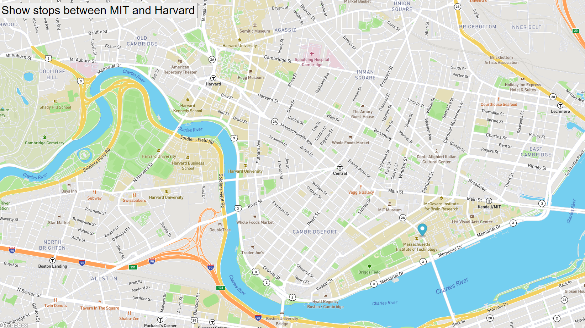

# Real Time Bus Tracker

## Description

This project tracks the bus stops between the MIT campus and the Harvard Campus.

## Installation

Download the files into a directory of your liking and click on the index.html file or open the file from the browser of your choice. Click on the Show Stops Between MIT and Harvard button to see the stops between the two campus.
<a href="https://jfernandez0524.github.io/busTracker/">View Repo Here</a>

### Future Improvements

In the future I will use the data from the local NJ Transit API to track real buses in NJ by choosing the bus line and tracking that line on the bus.

## License

MIT License

Copyright (c) 2022 JFernandez0524

Permission is hereby granted, free of charge, to any person obtaining a copy
of this software and associated documentation files (the "Software"), to deal
in the Software without restriction, including without limitation the rights
to use, copy, modify, merge, publish, distribute, sublicense, and/or sell
copies of the Software, and to permit persons to whom the Software is
furnished to do so, subject to the following conditions:

The above copyright notice and this permission notice shall be included in all
copies or substantial portions of the Software.

THE SOFTWARE IS PROVIDED "AS IS", WITHOUT WARRANTY OF ANY KIND, EXPRESS OR
IMPLIED, INCLUDING BUT NOT LIMITED TO THE WARRANTIES OF MERCHANTABILITY,
FITNESS FOR A PARTICULAR PURPOSE AND NONINFRINGEMENT. IN NO EVENT SHALL THE
AUTHORS OR COPYRIGHT HOLDERS BE LIABLE FOR ANY CLAIM, DAMAGES OR OTHER
LIABILITY, WHETHER IN AN ACTION OF CONTRACT, TORT OR OTHERWISE, ARISING FROM,
OUT OF OR IN CONNECTION WITH THE SOFTWARE OR THE USE OR OTHER DEALINGS IN THE
SOFTWARE.
